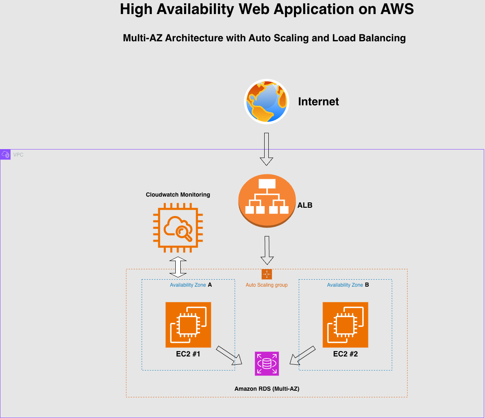

# High Availability Web Application on AWS

## Overview
Built a highly available web application using EC2, ALB, Auto Scaling, and RDS.

## Architecture

## AWS Services Used
- EC2
- Application Load Balancer
- Auto Scaling Group
- RDS
- Route 53
- CloudWatch

## Features
- Multi-AZ deployment
- Automatic scaling
- Health checks
- Fault tolerance

## Architecture Decisions
Why you chose each service.

## Deployment Steps
Step-by-step setup.

## Challenges
Problems encountered and solutions.

## Future Improvements
Things you'd improve later.