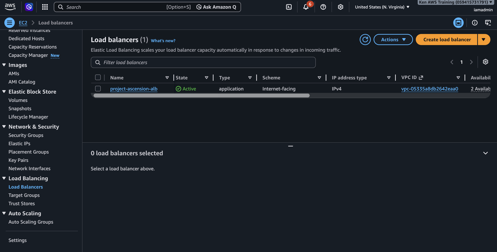
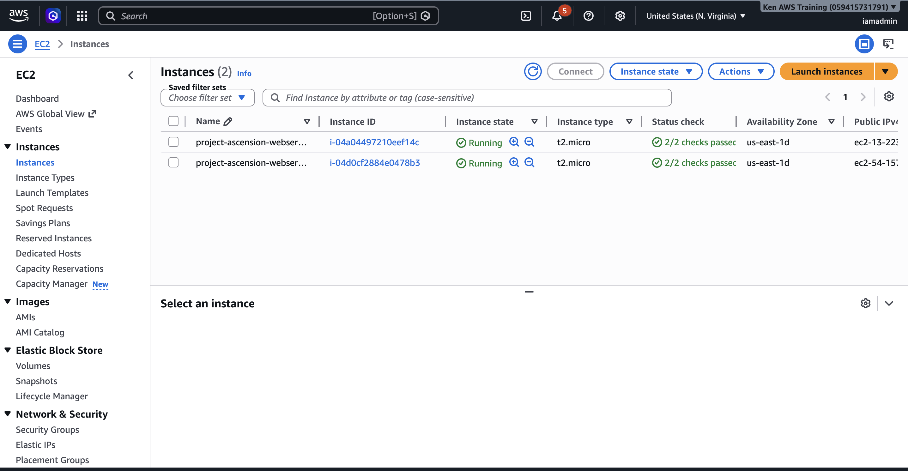
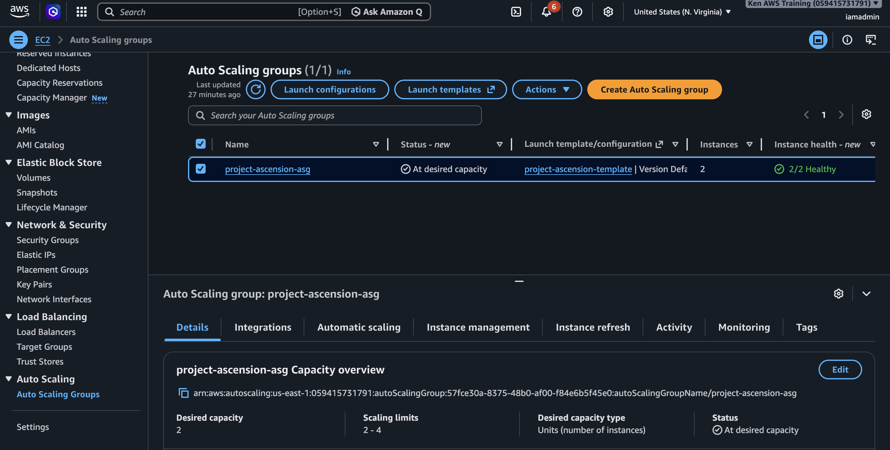
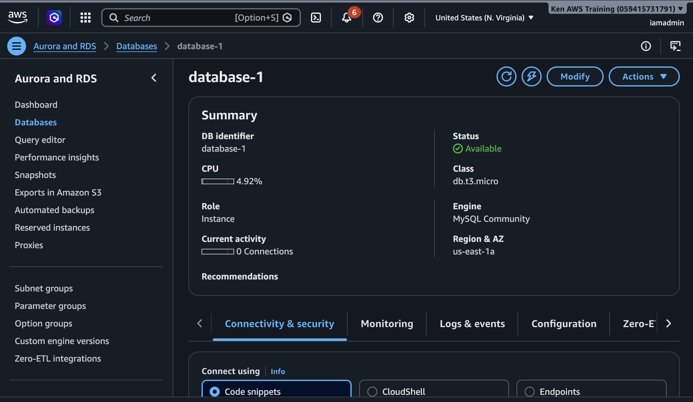
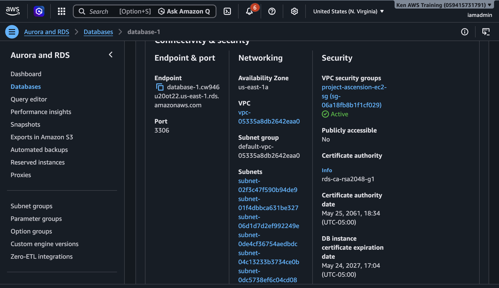
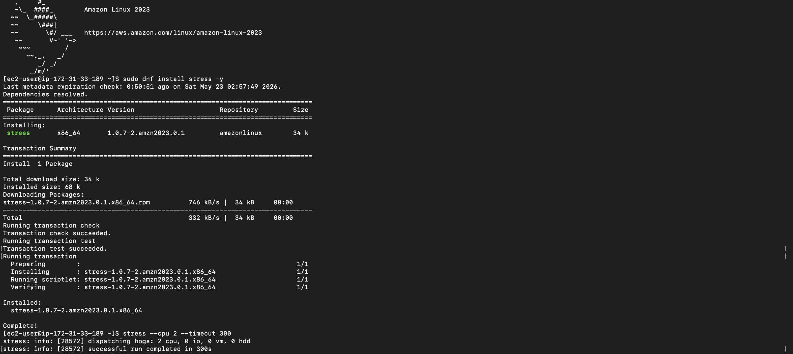
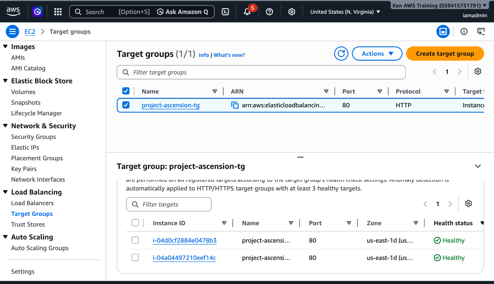

# High Availability Web Application on AWS

## Overview

This project demonstrates a highly available and scalable AWS web application architecture designed to survive EC2 instance failure and automatically distribute traffic across multiple Availability Zones.

The environment uses an Application Load Balancer (ALB), Auto Scaling Group (ASG), Launch Templates, Amazon RDS MySQL, CloudWatch monitoring, and EC2 web servers to simulate a production-style cloud deployment.

## Architecture

## Traffic Flow

1. User sends request to the Application Load Balancer
2. ALB forwards traffic to healthy EC2 instances
3. Target Group performs health checks
4. Auto Scaling Group replaces unhealthy instances automatically
5. CloudWatch monitors CPU usage and scaling events
6. EC2 instances securely connect to the RDS MySQL database inside the VPC

## AWS Services Used

- EC2
- Application Load Balancer
- Auto Scaling Group
- RDS
- Route 53
- CloudWatch

## Application Load Balancer

## EC2 Instances

## Auto Scaling Group

## RDS Database

## RDS Connectivity & Security

## Stress Testing

## Target Group Health Checks

## Features

- Multi-AZ deployment
- Automatic scaling
- Health checks
- Fault tolerance
- Managed MySQL database with Amazon RDS
- Secure private database connectivity

## Architecture Decisions

### Application Load Balancer
Used to distribute traffic across multiple EC2 instances and improve fault tolerance.

### Auto Scaling Group
Used to automatically replace failed EC2 instances and scale infrastructure during increased load.

### Amazon RDS
Used Amazon RDS MySQL to provide managed relational database services with secure VPC networking and automated backups.

### Multi-AZ Deployment
Improves high availability by reducing dependence on a single Availability Zone.

## Deployment Steps

1. Created VPC networking environment using default AWS VPC
2. Configured security group with HTTP and SSH access
3. Launched two Amazon Linux EC2 web servers
4. Automated Apache installation using EC2 User Data
5. Configured custom HTML landing pages for each instance
6. Verified server accessibility using public IPv4 addresses
7. Created Target Group for load balancing
8. Registered EC2 instances as healthy targets
9. Configured Application Load Balancer (ALB)
10. Tested traffic distribution across multiple EC2 instances
11. Implemented Auto Scaling Group with Launch Template
12. Validated health checks and automatic recovery behavior
13. Deployed Amazon RDS MySQL database inside the VPC
14. Configured database security group access for EC2 connectivity
15. Verified secure database networking and endpoint configuration

## What I Learned

- How Application Load Balancers distribute traffic
- Why Multi-AZ deployments improve availability
- How Auto Scaling Groups maintain infrastructure health
- How Launch Templates automate deployments
- How CloudWatch integrates with scaling policies
- Importance of security group design
- How RDS integrates with EC2 applications securely inside a VPC
- Difference between public and private database access
- Basics of managed relational databases in AWS

## Challenges

### Availability Zone Placement
Initially launched both EC2 instances in the same Availability Zone. Corrected the deployment by relaunching one instance in a separate AZ to improve fault tolerance and simulate production-grade high availability architecture.

### HTTP Connectivity Issues
Encountered browser timeout errors when testing web server access. Resolved by verifying security group inbound rules and ensuring HTTP traffic on port 80 was allowed.

### SSH Connection Troubleshooting
Experienced issues reconnecting to EC2 instances after closing local terminal sessions. Learned how to properly reconnect using the PEM key and instance public IPv4 addresses.

### User Data Automation Validation
Validated that Apache installation and webpage deployment executed automatically during EC2 launch using User Data scripts, reducing manual server configuration steps.

## Future Improvements

- Add HTTPS using ACM
- Register custom domain with Route53
- Use Terraform for Infrastructure as Code
- Deploy inside private/public subnet architecture
- Add CI/CD pipeline with GitHub Actions
- Containerize application with Docker
- Deploy RDS in private subnets
- Configure Multi-AZ database deployment
- Connect application dynamically to RDS endpoint