# Production-Style AWS VPC Infrastructure

## Project Overview

This project demonstrates the design and deployment of a production-style AWS VPC infrastructure using Terraform as Infrastructure as Code (IaC).

The environment was built to simulate real-world cloud networking architecture by implementing public and private subnet segmentation, controlled internet access, secure internal communication, and automated infrastructure provisioning.

The infrastructure includes:
- A custom VPC
- Public and private subnets across multiple Availability Zones
- Internet Gateway configuration
- NAT Gateway architecture
- Public and private route tables
- Security group segmentation
- Public and private EC2 instances
- Bastion-style SSH access
- Automated EC2 bootstrapping using Terraform user data

All infrastructure was provisioned and destroyed using Terraform.

---

## Architecture Diagram

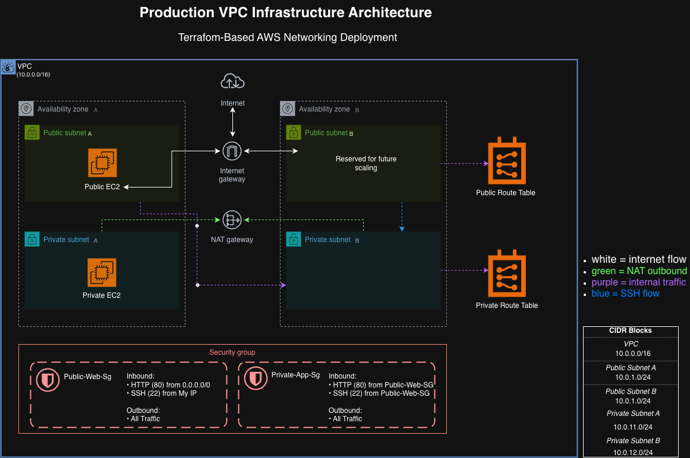

## Architecture Goals

The primary goals of this project were to:

- Build a production-style AWS network architecture
- Implement secure public/private subnet separation
- Configure outbound internet access for private resources using a NAT Gateway
- Deploy EC2 instances into segmented network tiers
- Implement bastion-host style SSH access patterns
- Automate infrastructure deployment with Terraform
- Gain hands-on experience troubleshooting AWS networking and security configurations

---

## AWS Services Used

- Amazon VPC
- Amazon EC2
- Internet Gateway
- NAT Gateway
- Route Tables
- Security Groups
- Elastic IPs
- Terraform
- AWS IAM
- AWS CLI

---

## Infrastructure Architecture

The environment was designed using a multi-tier networking model:

### Public Subnets
- Internet-facing resources
- Bastion-style access
- Public EC2 instance hosting a web server

### Private Subnets
- Internal application resources
- No direct public internet exposure
- Outbound internet access through NAT Gateway only

### Traffic Flow

Internet → Internet Gateway → Public Subnet → Private Subnet → NAT Gateway → Internet

---

## CIDR Design

| Resource | CIDR Block |
|---|---|
| VPC | 10.0.0.0/16 |
| Public Subnet A | 10.0.1.0/24 |
| Public Subnet B | 10.0.2.0/24 |
| Private Subnet A | 10.0.11.0/24 |
| Private Subnet B | 10.0.12.0/24 |

---

## Key Infrastructure Components

### Virtual Private Cloud (VPC)

A custom VPC was created using the CIDR block:

10.0.0.0/16

The VPC was configured with:
- DNS support enabled
- DNS hostnames enabled
- Public and private subnet segmentation
- Multi-AZ architecture

---

### Public Subnets

Two public subnets were created across separate Availability Zones:

- public-subnet-a
- public-subnet-b

These subnets:
- route traffic to the Internet Gateway
- support internet-facing resources
- automatically assign public IP addresses to instances

The public subnet layer hosted:
- a public EC2 web server
- bastion-style SSH access

---

### Private Subnets

Two private subnets were deployed across separate Availability Zones:

- private-subnet-a
- private-subnet-b

These subnets:
- do not expose resources directly to the internet
- have no public IP assignment
- use a NAT Gateway for outbound internet access only

The private subnet layer hosted:
- a private application EC2 instance

---

### Internet Gateway

An Internet Gateway was attached to the VPC to allow internet access for public subnet resources.

The public route table included:

0.0.0.0/0 → Internet Gateway

This allowed:
- public web traffic
- SSH access
- outbound internet communication

---

### NAT Gateway

A NAT Gateway was deployed inside a public subnet and associated with an Elastic IP.

The private route table included:

0.0.0.0/0 → NAT Gateway

This allowed private subnet resources to:
- install packages
- perform updates
- access external services

while remaining inaccessible directly from the public internet.

---

### Security Groups

Security groups were configured to implement controlled traffic flow between network tiers.

#### public-web-sg

Allowed:
- HTTP traffic from the internet
- SSH access from my public IP

#### private-app-sg

Allowed:
- Internal SSH traffic from the public security group
- Internal application traffic from the public subnet layer

This architecture simulated real-world segmented security design.

---

## Terraform Workflow

Terraform was used to provision, update, validate, and destroy the infrastructure.

The main Terraform workflow used in this project was:

```bash
terraform init
terraform validate
terraform plan
terraform apply
terraform destroy
```

### terraform init

Initialized the Terraform working directory and downloaded the required AWS provider.

### terraform validate

Checked the Terraform configuration for syntax errors.

### terraform plan

Previewed the infrastructure changes before applying them.

### terraform apply

Provisioned the AWS resources defined in the Terraform configuration.

### terraform destroy

Safely destroyed all Terraform-managed infrastructure to prevent unnecessary AWS charges.

---

## EC2 Deployment

Two EC2 instances were deployed:

### Public Web Server

The public EC2 instance was deployed into a public subnet and assigned a public IPv4 address.

It was configured with:
- Public subnet placement
- Public security group
- HTTP access
- SSH access from my IP
- Automated Apache installation using user data

### Private Application Server

The private EC2 instance was deployed into a private subnet with no public IPv4 address.

It was configured with:
- Private subnet placement
- Private security group
- No direct public internet access
- Outbound internet access through the NAT Gateway
- Internal SSH access from the public web server

---

## User Data Automation

Terraform user data was used to bootstrap the public web server automatically.

The script:
- updated the instance
- installed Apache
- enabled the web server
- started the web server
- created a simple test webpage

This allowed the EC2 instance to become web-accessible after launch without manually installing software.

---

## SSH Access Flow

The private EC2 instance was intentionally deployed without a public IPv4 address to simulate a production-style private application server.

To securely access the private instance:

1. SSH into the public web server
2. Use SSH agent forwarding to connect internally to the private EC2 instance
3. Access the private server through its private IP address only

Example flow:

```bash
ssh -A -i project-ascension-key.pem ec2-user@PUBLIC_IP
```

Then from inside the public server:

```bash
ssh ec2-user@PRIVATE_IP
```

This architecture demonstrates:
- Bastion host access patterns
- Secure internal-only infrastructure
- SSH agent forwarding
- Private subnet isolation
- Production-style server access design

---

## NAT Gateway Validation

The private EC2 instance successfully reached the internet through the NAT Gateway while remaining inaccessible from the public internet.

Validation performed from the private EC2 instance:

```bash
curl ifconfig.me
```

Result:
- Outbound internet access worked successfully
- Private instance remained inside a private subnet
- No public IPv4 address was assigned
- Internet access was routed through the NAT Gateway

This confirmed:
- Route table configuration
- NAT Gateway functionality
- Private subnet outbound routing
- Secure production-style networking behavior

---

## Security Groups

Separate security groups were created for the public web server and the private application server.

### Public Web Security Group

Allowed:
- HTTP (Port 80) from anywhere
- SSH (Port 22) from my public IP address

Purpose:
- Allow public web traffic
- Restrict administrative SSH access

### Private App Security Group

Allowed:
- HTTP (Port 80) from the public web server security group
- SSH (Port 22) from the public web server security group

Purpose:
- Prevent direct public access
- Allow only internal VPC communication
- Enforce secure layered architecture

This security group design demonstrates:
- Least privilege access
- Internal service communication
- Security group referencing
- Production-style segmentation

---

## Route Tables and Networking

Custom route tables were configured for both public and private subnet traffic management.

### Public Route Table

Routes:
- Local VPC traffic
- Internet-bound traffic through the Internet Gateway

Purpose:
- Enable inbound and outbound internet connectivity for public resources

### Private Route Table

Routes:
- Local VPC traffic
- Internet-bound traffic through the NAT Gateway

Purpose:
- Allow outbound internet access for private resources
- Prevent inbound public internet access

This networking configuration demonstrates:
- Network segmentation
- Controlled internet exposure
- Secure outbound routing
- Production VPC architecture

---

## Terraform Usage

Terraform was used to provision and manage the entire AWS infrastructure as Infrastructure as Code (IaC).

Resources deployed with Terraform included:
- VPC
- Public and private subnets
- Internet Gateway
- NAT Gateway
- Route tables and associations
- Security groups
- Elastic IP
- EC2 instances

Core Terraform workflow used during the project:

```bash
terraform init
```

```bash
terraform plan
```

```bash
terraform apply
```

```bash
terraform destroy
```

This project demonstrates:
- Infrastructure as Code principles
- Automated cloud provisioning
- Repeatable deployments
- Infrastructure lifecycle management
- Production-style AWS automation

---

## Project Validation

The infrastructure was successfully validated through multiple tests.

Completed validation steps:
- Public EC2 web server accessible through browser
- Apache installed automatically with user data
- Private EC2 deployed without public IPv4 address
- Successful SSH connection from public EC2 to private EC2
- Successful outbound internet access from private EC2 through NAT Gateway
- Route tables functioning correctly
- Security groups enforcing intended traffic flow

Validation screenshots were captured throughout the deployment process.

---

## Key AWS Services Used

- Amazon VPC
- Amazon EC2
- Security Groups
- Internet Gateway
- NAT Gateway
- Elastic IP
- Route Tables
- Terraform
- User Data Bootstrapping

---

## Skills Demonstrated

- AWS networking
- VPC architecture design
- Public and private subnet deployment
- Infrastructure as Code (Terraform)
- Linux administration
- SSH and bastion host access
- Security group configuration
- NAT Gateway routing
- Route table management
- EC2 deployment automation
- Production-style cloud architecture

---

## Lessons Learned

Throughout this project, I gained hands-on experience with real-world AWS networking and infrastructure deployment.

Key lessons learned:
- How public and private subnets function inside a VPC
- Why private resources should not have direct internet exposure
- How NAT Gateways provide secure outbound internet access
- How route tables control subnet traffic flow
- How security groups regulate instance communication
- How Terraform automates infrastructure deployment
- How SSH agent forwarding enables secure private server access
- How production environments separate public-facing and internal resources

This project also improved my:
- Cloud troubleshooting skills
- Terraform workflow understanding
- AWS console navigation
- Linux command-line usage
- Infrastructure debugging process

---

## Future Improvements

Possible future enhancements for this infrastructure include:

- Application Load Balancer (ALB)
- Auto Scaling Groups (ASG)
- Multi-AZ high availability
- RDS database integration
- CloudWatch monitoring and alarms
- S3 static asset hosting
- CloudFront CDN integration
- HTTPS with ACM certificates
- CI/CD deployment pipeline
- Remote Terraform state management with S3 and DynamoDB

---

## Repository Structure

```text
02-production-vpc-infrastructure/
│
├── architecture/
├── notes/
├── screenshots/
├── scripts/
├── terraform/
├── README.md
```

---

## Author

Built by Kendall Marshall as part of my AWS Cloud Engineering and Solutions Architect learning journey.

This project was created to strengthen:
- AWS networking knowledge
- Terraform skills
- Infrastructure automation experience
- Production architecture understanding

GitHub Portfolio:
- aws-project-portfolio

---

## Deployment Screenshots

### Terraform Plan

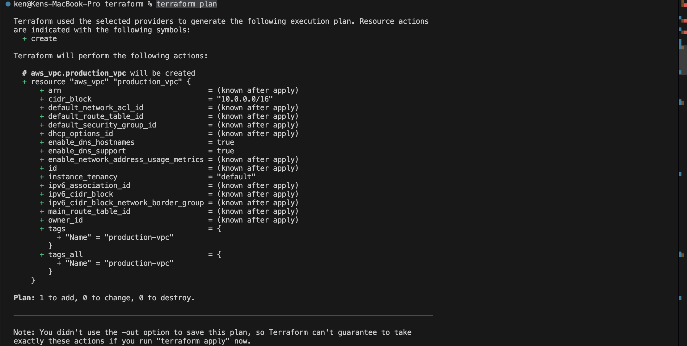

---

### Terraform Apply

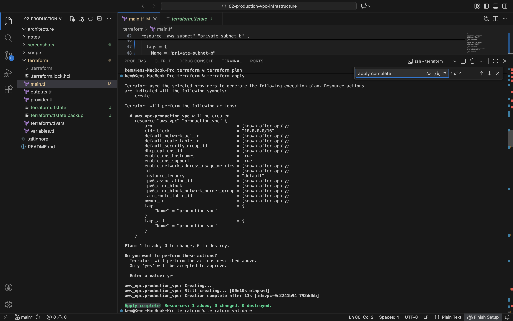

---

### Production VPC

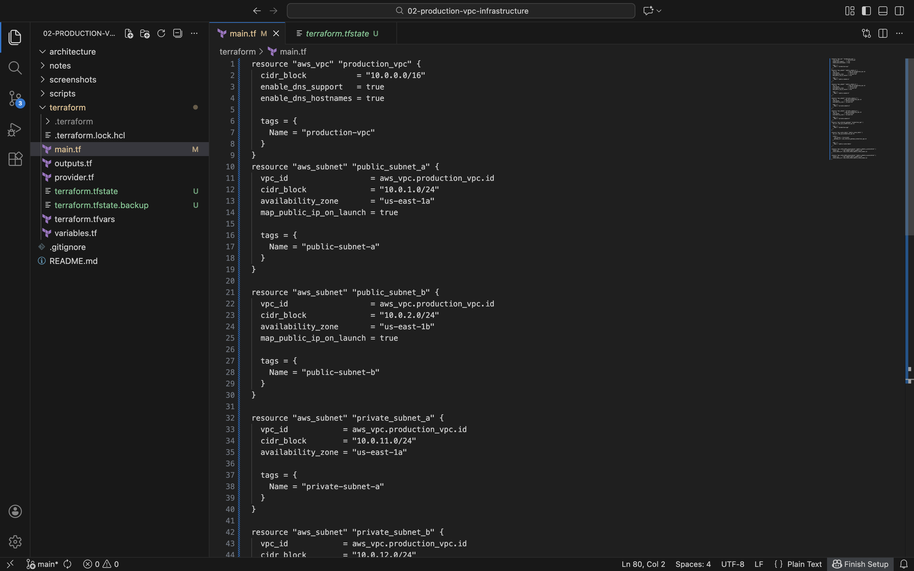

---

### Public and Private Subnets

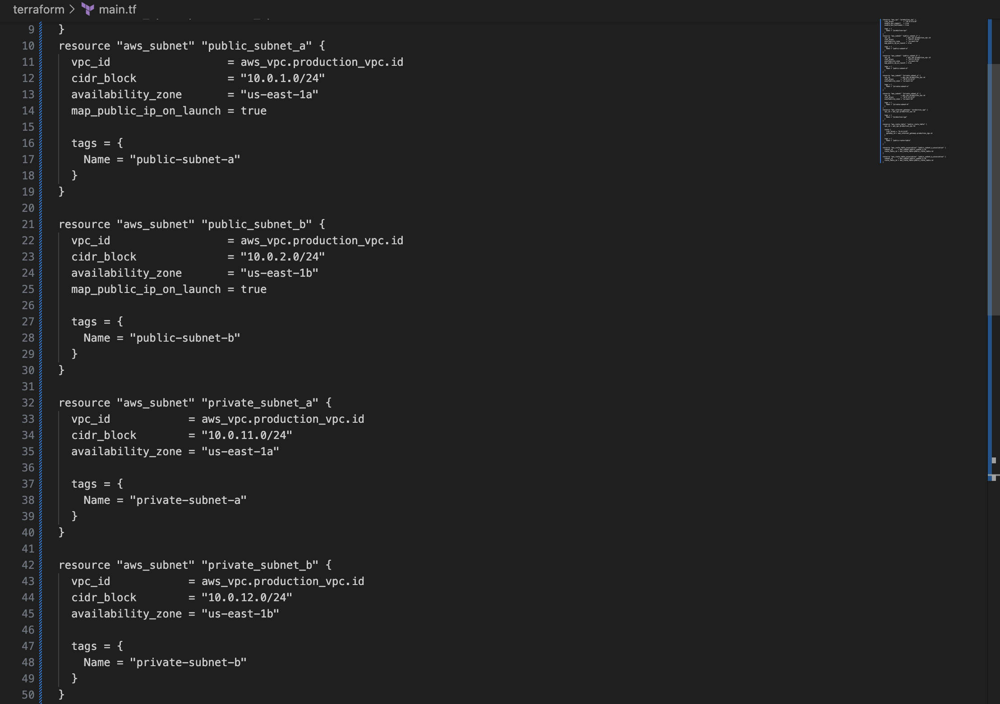

---

### Internet Gateway and Route Tables

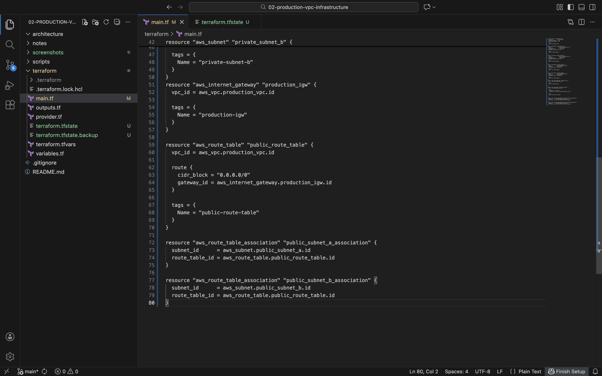

---

### NAT Gateway

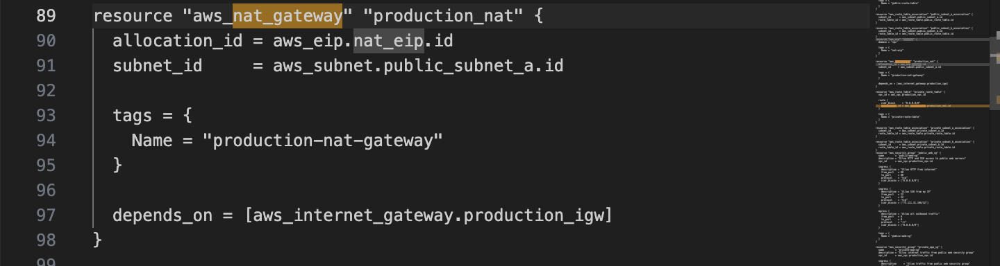

---

### Security Groups

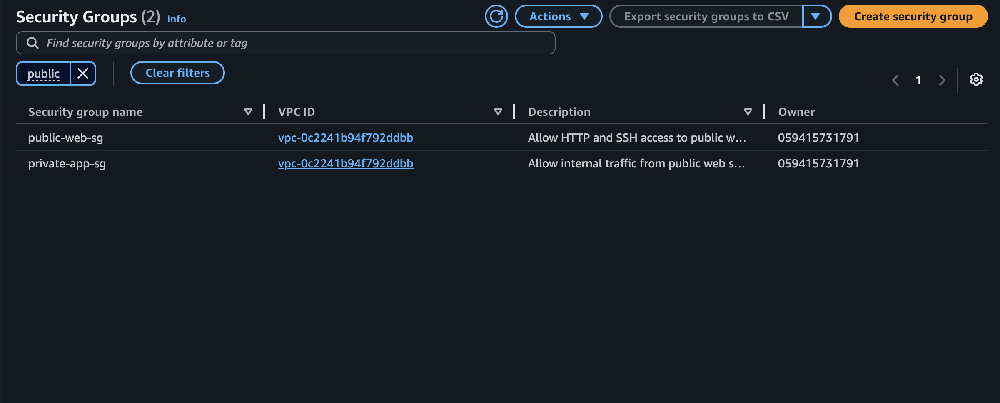

---

### Working Public Web Server

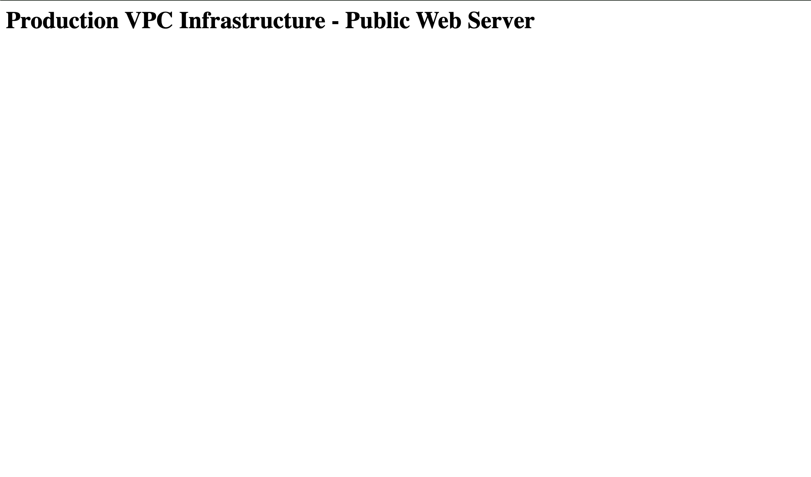

---

### Public and Private EC2 Instances

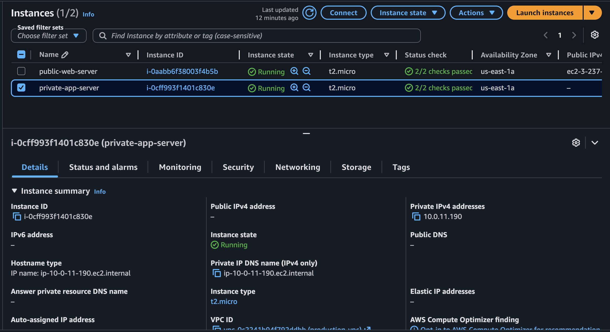

---

### SSH Into Private Instance Through Public Bastion Host

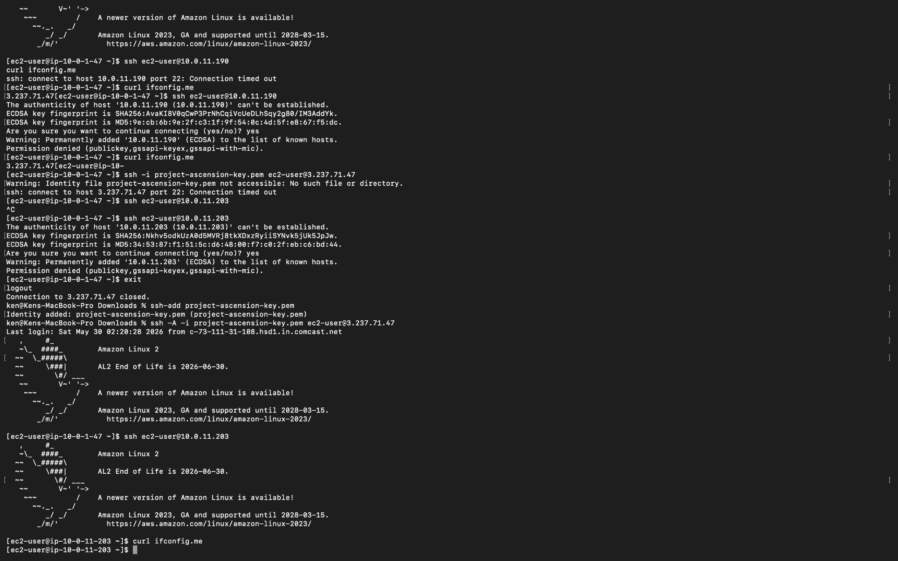

---