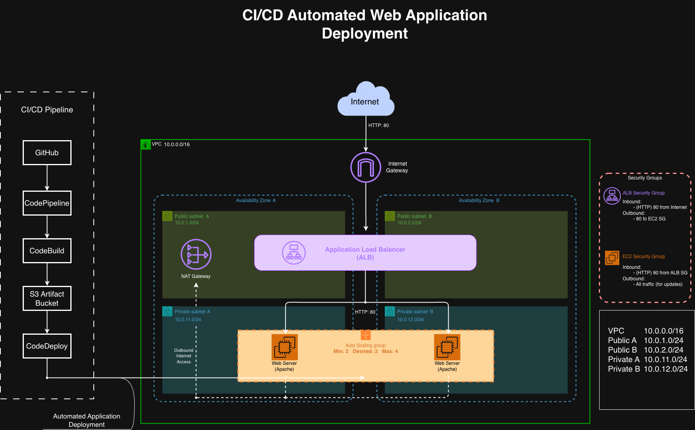
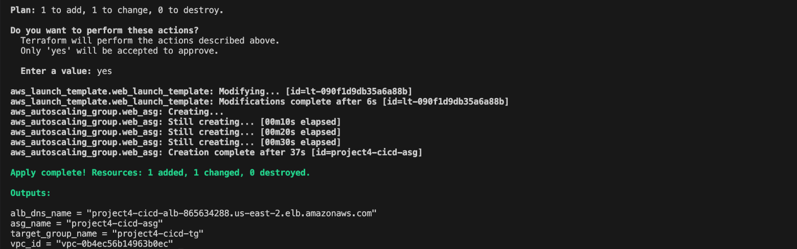
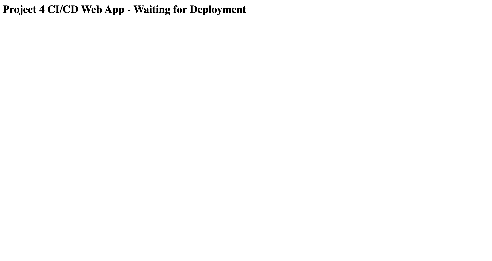
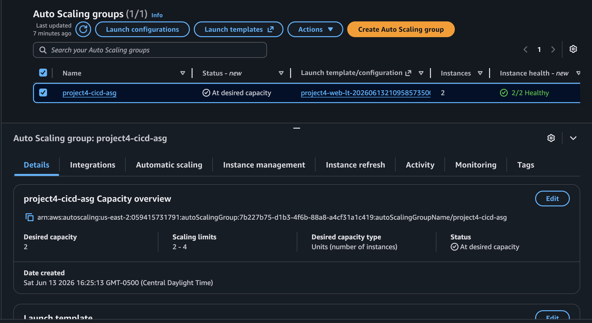
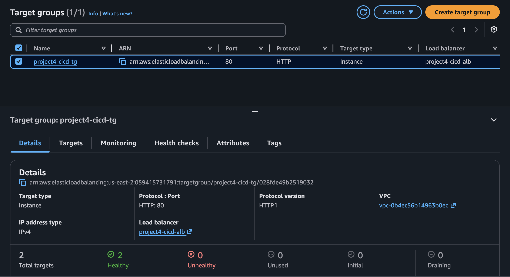
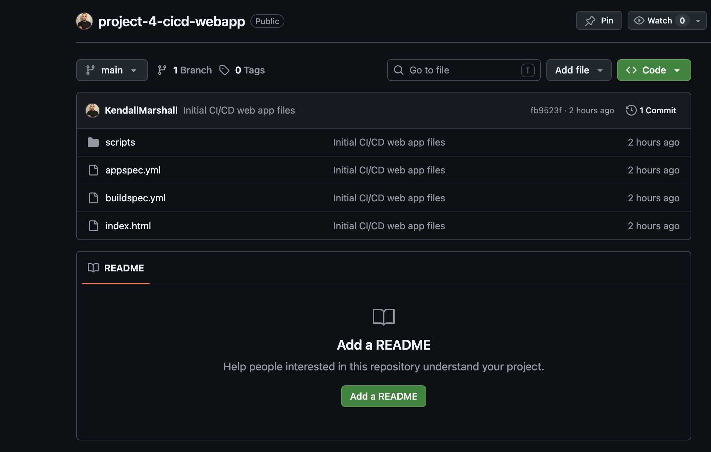
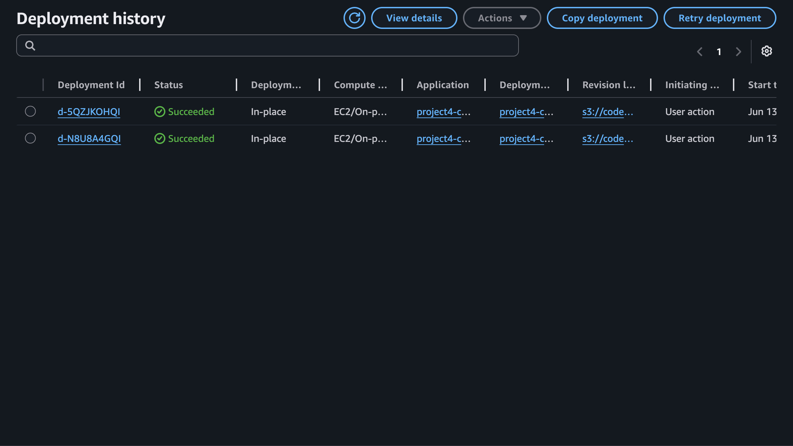
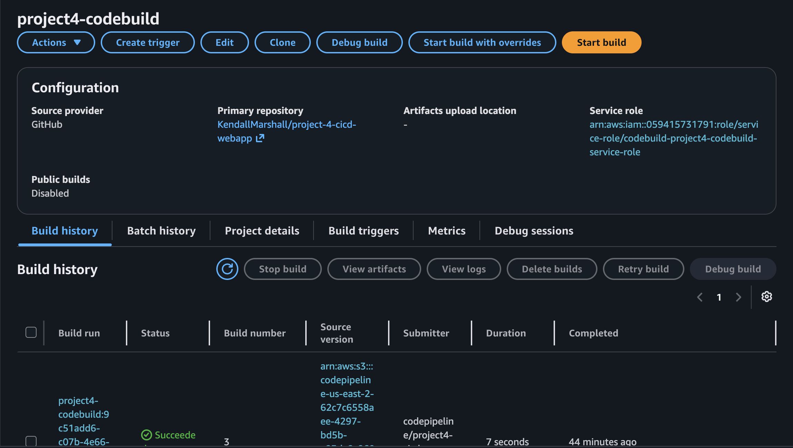
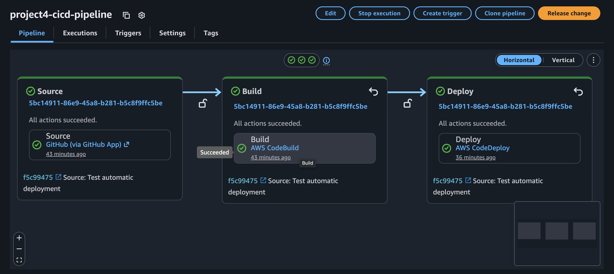
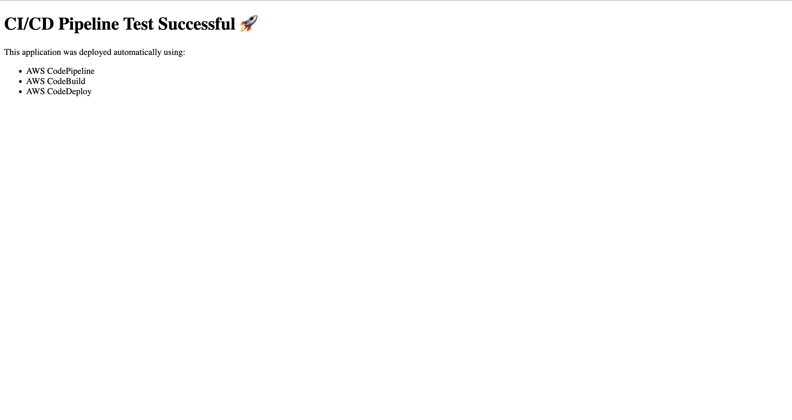

# Project 4 - CI/CD Automated Web Application Deployment

## Overview

This project demonstrates a complete CI/CD pipeline on AWS using GitHub, CodePipeline, CodeBuild, and CodeDeploy.

Any code pushed to GitHub automatically triggers a deployment pipeline that builds and deploys updates to an Auto Scaling Group behind an Application Load Balancer without requiring manual SSH access to the servers.

## Architecture

[Architecture Diagram Here]

## Technologies Used

- AWS CodePipeline
- AWS CodeBuild
- AWS CodeDeploy
- GitHub
- EC2
- Auto Scaling Groups
- Application Load Balancer
- IAM
- Terraform
- Bash
- YAML

## Project Objectives

- Automate application deployments
- Eliminate manual server updates
- Implement Infrastructure as Code
- Create a production-style deployment workflow
- Demonstrate Continuous Integration and Continuous Deployment

## Architecture Components

### Source Stage

GitHub repository stores application code and deployment configuration files.

### Build Stage

AWS CodeBuild validates and packages application artifacts.

### Deploy Stage

AWS CodeDeploy deploys the application to EC2 instances inside the Auto Scaling Group.

### Load Balancer

Application Load Balancer distributes traffic across multiple instances.

### Auto Scaling Group

Maintains application availability and automatically replaces unhealthy instances.

## Deployment Workflow

1. Developer pushes code to GitHub
2. GitHub triggers CodePipeline
3. CodePipeline starts CodeBuild
4. CodeBuild packages application artifacts
5. CodeDeploy deploys the application
6. Auto Scaling Group instances receive updates
7. Application Load Balancer serves updated content

## CI/CD Validation Test

To verify the pipeline functionality:

1. Modified the application homepage
2. Committed changes to GitHub
3. Pushed changes to the repository
4. CodePipeline automatically triggered
5. CodeBuild successfully completed
6. CodeDeploy successfully deployed the update
7. Updated content appeared on the live application

This confirmed end-to-end automated deployment functionality.

## Screenshots

### Architecture Diagram

### Terraform Apply Complete

### Application Before CI/CD Update

### Auto Scaling Group

### Target Group Health Checks

### GitHub Repository

### CodeDeploy Deployment Group

### CodeBuild Project

### Successful CodePipeline Execution

### Live Application After Deployment

## Challenges Encountered

### GitHub Connection Configuration

Configured AWS CodeConnections and GitHub App integration to establish secure communication between GitHub and AWS services.

### Deployment Configuration

Created deployment lifecycle scripts and AppSpec configuration files to automate deployment actions.

### Pipeline Validation

Verified that GitHub commits automatically triggered the entire deployment workflow without manual intervention.

## Key Skills Demonstrated

- CI/CD Pipeline Design
- Infrastructure as Code
- AWS CodePipeline
- AWS CodeBuild
- AWS CodeDeploy
- GitHub Integration
- Bash Scripting
- YAML Configuration
- Auto Scaling
- Load Balancing
- Troubleshooting
- Cloud Automation

## Terraform Cleanup

All AWS infrastructure was removed using Terraform destroy after project validation to prevent ongoing cloud costs.