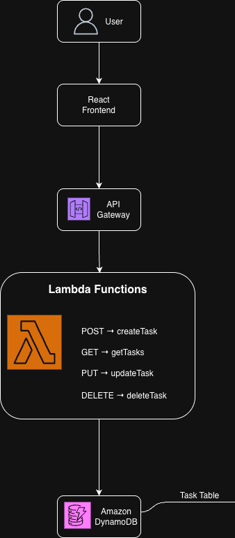
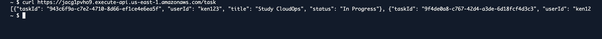
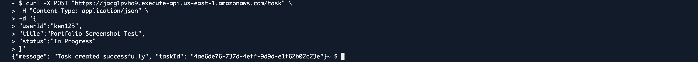
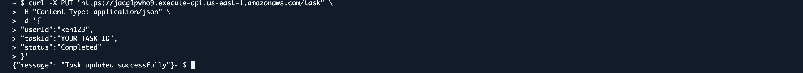
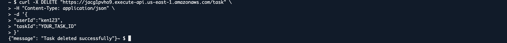

# Project 05 – Serverless Task Tracker Application

## Overview

This project is a fully serverless task management application built on AWS.

Users can create, retrieve, update, and delete tasks through RESTful API endpoints exposed by Amazon API Gateway. Business logic is handled by AWS Lambda functions, while task data is stored in Amazon DynamoDB.

The architecture eliminates the need to manage servers while providing scalable, event-driven functionality.

## Architecture

The application uses a React frontend, Amazon Cognito for authentication, Amazon API Gateway for API routing, AWS Lambda for backend logic, and Amazon DynamoDB for task storage.

## AWS Services Used

- Amazon API Gateway
- AWS Lambda
- Amazon DynamoDB
- AWS CloudShell
- IAM

## Core Features

- Create new tasks
- Retrieve all tasks
- Update task status
- Delete tasks
- Serverless architecture
- RESTful API design
- DynamoDB data persistence

## Architecture Diagram

## CRUD Operations

### Create Task

POST /task

Creates a new task record in DynamoDB.

### Retrieve Tasks

GET /task

Returns all task records.

### Update Task

PUT /task

Updates an existing task status.

### Delete Task

DELETE /task

Removes a task from DynamoDB.

## Deployment Steps

1. Created DynamoDB TaskTable
2. Configured primary key structure
3. Created createTask Lambda function
4. Created getTasks Lambda function
5. Created updateTask Lambda function
6. Created deleteTask Lambda function
7. Assigned IAM permissions
8. Created API Gateway HTTP API
9. Configured routes:
   - POST /task
   - GET /task
   - PUT /task
   - DELETE /task
10. Connected routes to Lambda integrations
11. Tested endpoints using CloudShell cURL commands

## Testing

### GET Request

Successfully returned task records.

### POST Request

Successfully created task records.

### PUT Request

Successfully updated task status.

### DELETE Request

Successfully deleted task records.

## Challenges & Lessons Learned

### API Gateway Route Configuration

Initially received "Not Found" errors when accessing the API endpoint. Learned that API Gateway requires the configured resource path (/task) to be appended to the invoke URL.

### Lambda Payload Formatting

Encountered issues passing JSON payloads through cURL requests. Learned proper request formatting and content-type headers.

### DynamoDB Operations

Gained hands-on experience with PutItem, Scan, UpdateItem, and DeleteItem operations through AWS Lambda integrations.

## Future Improvements

- Add Amazon Cognito authentication
- Deploy React frontend
- Implement user-specific task filtering
- Add task due dates and priorities
- Infrastructure as Code with Terraform